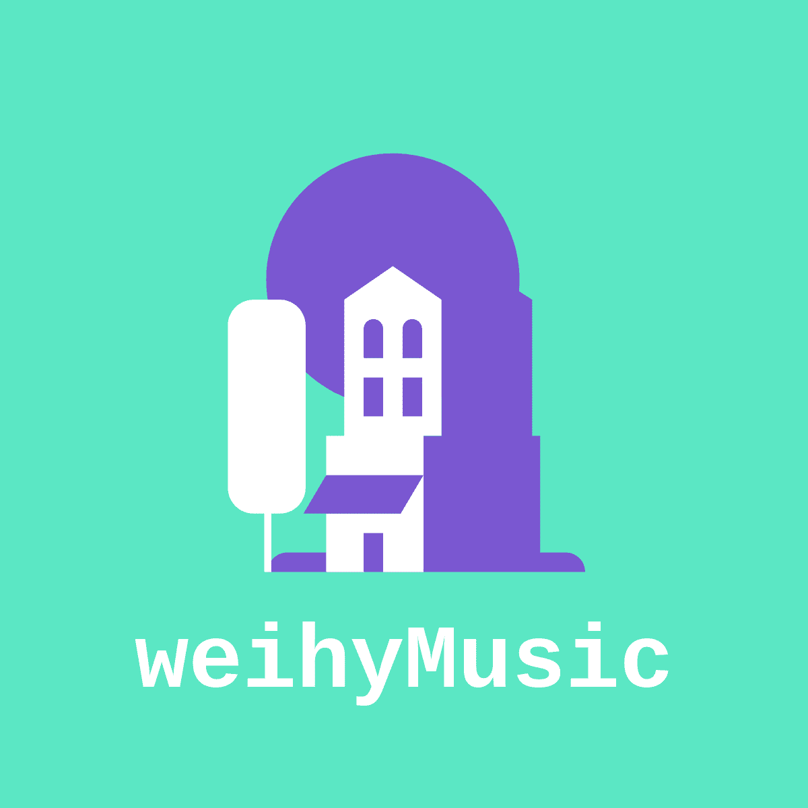

# ProjectName

weihyMusic：原生微信小程序

<!-- PROJECT SHIELDS

[![Contributors][contributors-shield]][contributors-url]
[![Forks][forks-shield]][forks-url]
[![Stargazers][stars-shield]][stars-url]
[![Issues][issues-shield]][issues-url]
[![MIT License][license-shield]][license-url]
[![LinkedIn][linkedin-shield]][linkedin-url] -->

<!-- PROJECT LOGO -->
<br />

<p align="center">
  <a href="https://github.com/shaojintian/Best_README_template/">
    
  </a>

  <h3 align="center">weihyMusic</h3>
  <p align="center">
    基于原生JavaScript的音乐小程序
  </p>
</p>

 本篇README.md面向开发者
 
## 目录

- [上手指南](#上手指南)
  - [开发前的配置要求](#开发前的配置要求)
  - [安装步骤](#安装步骤)
- [部署](#部署)
- [使用到的框架](#使用到的框架)
- [如何参与开源项目](#如何参与开源项目)
- [版本控制](#版本控制)
- [作者](#作者)
- [鸣谢](#鸣谢)

### 上手指南


###### 开发前的配置要求

1. Nodejs >= v14
2. 微信开发者id

###### **安装步骤**

1.Clone the repo

```sh
git clone https://github.com/weihyZzz/weihyMusic.git
```

### 部署

1.安装npm依赖包
```
npm install
```
2.微信开发者工具 => 工具 => 构建npm

3.编译执行

### 使用到的框架

- [原生微信小程序](https://developers.weixin.qq.com/miniprogram/dev/framework/)
- [vant](https://github.com/youzan/vant)


### 如何参与开源项目

贡献使开源社区成为一个学习、激励和创造的绝佳场所。你所作的任何贡献都是**非常感谢**的。


1. Fork the Project
2. Create your Feature Branch (`git checkout -b feature/AmazingFeature`)
3. Commit your Changes (`git commit -m 'Add some AmazingFeature'`)
4. Push to the Branch (`git push origin feature/AmazingFeature`)
5. Open a Pull Request


### 版本控制

该项目使用Git进行版本管理。您可以在repository参看当前可用版本。

### 作者

weihy@weihyZzz


### 版权说明

该项目签署了MIT 授权许可，详情请参阅 [LICENSE.txt](https://github.com/shaojintian/Best_README_template/blob/master/LICENSE.txt)

### 鸣谢


- [GitHub Emoji Cheat Sheet](https://www.webpagefx.com/tools/emoji-cheat-sheet)
- [Img Shields](https://shields.io)
- [Choose an Open Source License](https://choosealicense.com)
- [GitHub Pages](https://pages.github.com)
- [Animate.css](https://daneden.github.io/animate.css)

<!-- links -->
[your-project-path]:shaojintian/Best_README_template
[contributors-shield]: https://img.shields.io/github/contributors/shaojintian/Best_README_template.svg?style=flat-square
[contributors-url]: https://github.com/shaojintian/Best_README_template/graphs/contributors
[forks-shield]: https://img.shields.io/github/forks/shaojintian/Best_README_template.svg?style=flat-square
[forks-url]: https://github.com/shaojintian/Best_README_template/network/members
[stars-shield]: https://img.shields.io/github/stars/shaojintian/Best_README_template.svg?style=flat-square
[stars-url]: https://github.com/shaojintian/Best_README_template/stargazers
[issues-shield]: https://img.shields.io/github/issues/shaojintian/Best_README_template.svg?style=flat-square
[issues-url]: https://img.shields.io/github/issues/shaojintian/Best_README_template.svg
[license-shield]: https://img.shields.io/github/license/shaojintian/Best_README_template.svg?style=flat-square
[license-url]: https://github.com/shaojintian/Best_README_template/blob/master/LICENSE.txt
[linkedin-shield]: https://img.shields.io/badge/-LinkedIn-black.svg?style=flat-square&logo=linkedin&colorB=555
[linkedin-url]: https://linkedin.com/in/shaojintian


